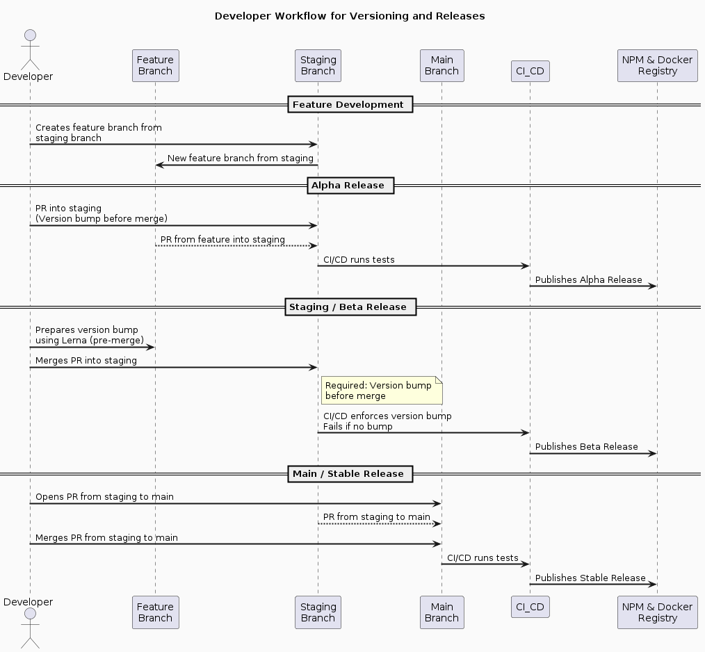

# Lerna Versioning System

**tl;dr: Use Lerna's fixed versioning scheme and bump the version right before merging into the staging branch to create a beta release. Alpha releases are created from PRs into staging, and stable releases are created from merges into the main branch.**

Our project uses Lerna to manage package versions in our monorepo with a fixed versioning scheme. This approach simplifies the version management process by keeping a single, synchronized version number across all packages. Additionally, we follow the Conventional Commits specification to make commit messages more readable and to automate the versioning process.

- [Docs: Lerna Versioning & Publishing](https://lerna.js.org/docs/features/version-and-publish)
- `npx lerna init [--dryRun]` to setup Lerna
- [`lerna version --conventional-commits`](https://github.com/lerna/lerna/tree/main/libs/commands/version#--conventional-commits): When run with this flag, `lerna version` will use the [Conventional Commits Specification](https://conventionalcommits.org/) to [determine the version bump](https://github.com/conventional-changelog/conventional-changelog/tree/master/packages/conventional-recommended-bump) and [generate CHANGELOG.md files](https://github.com/conventional-changelog/conventional-changelog/tree/master/packages/conventional-changelog-cli). Passing `--no-changelog` will disable the generation (or updating) of `CHANGELOG.md` files.
- [`lerna version --conventional-commits --create-release`](https://github.com/lerna/lerna/blob/main/libs/commands/version/README.md#--create-release-type)



## Explicit guide for developers on managing versions

1. **Feature Branch Creation**: For new features, enhancements, or bug fixes, create a feature branch from the staging branch.

2. **Development and Alpha Release**: Develop on your feature branch. Opening PRs into the staging branch will trigger alpha releases for testing. Alpha releases do not require a version bump.

3. **Code Review**: Submit your completed feature for review through a PR. It must pass all automated tests and adhere to our quality standards.

4. **Conventional Commits**: Write commit messages that comply with the Conventional Commits standard. This practice allows us to generate changelogs and version numbers automatically based on the semantic meaning of commit messages.

5. **Pre-Merge Versioning into Staging for Beta Release**: Once your PR is approved into Staging, perform a version bump using Lerna's fixed versioning scheme, right before merging. This step is crucial for creating a beta release:

   ```bash
   # Run from root directory
   yarn lerna:version 
   ```

6. **Finalize Version Bump**: Commit the version changes, including `package.json` and changelog updates, and push them to your feature branch:

   ```bash
   git push origin feature-branch
   ```

7. **Merge to Staging**: Merge your feature branch into the staging branch. This merge must include the version bump commit as the last commit. The CI/CD pipeline will check for the version bump and will reject the merge if the version has not been incremented. Upon a successful merge, a beta release is published.

8. **Staging Environment Validation**: Conduct thorough testing in the staging environment, including User Acceptance Testing (UAT) and integration testing, to validate the beta release.

9. **Stable Release and Promotion to Production**: After the beta release has been validated in staging and is deemed stable, merge it into the main branch. This action will trigger the CI/CD pipeline to publish a stable release, which is then deployed to the production environment.

By adhering to this process, we maintain a clear and consistent versioning strategy that simplifies the release management process. Using Lerna's fixed versioning scheme ensures that all packages move forward in lockstep, which is particularly helpful for coordinating dependencies within the monorepo. Conventional Commits facilitate this automated process, allowing us to focus on developing features rather than managing versions manually.